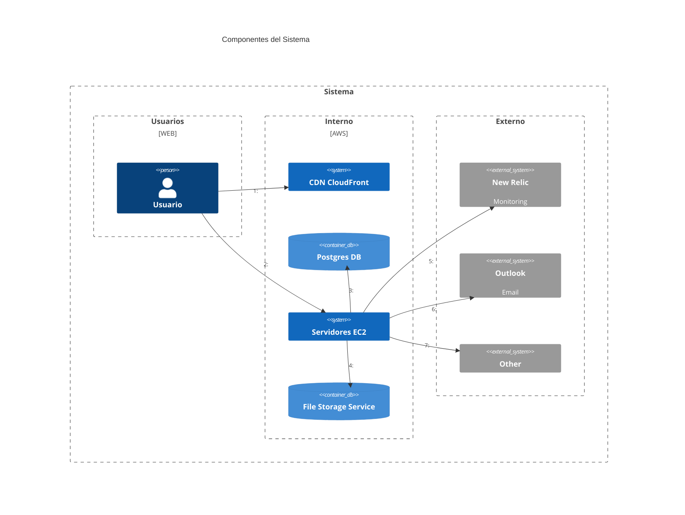

# Requerimientos de Interfaz v0.1

# Identificación de Interfaces

```mermaid
C4Dynamic
	title Componentes del Sistema

	Boundary(system, "Sistema", "") {
	  UpdateLayoutConfig($c4ShapeInRow="1", $c4BoundaryInRow="4")
	  Boundary(usuario, "Usuarios", "WEB") {
	    Person(user, "Usuario")
	  }
	
		Boundary(aws, "Interno", "AWS") {
			System(cloudfront, "CDN CloudFront")
			ContainerDb(rds, "Postgres DB")
			System(ec2, "Servidores EC2")
			ContainerDb(s3, "File Storage Service")
		}
	
	  Boundary(external, "Externo", "") {
	    System_Ext(newrelic, "New Relic", "Monitoring")
	    System_Ext(mail, "Outlook", "Email")
			System_Ext(other, "Other", "")
	  }
	}

	Rel(user, cloudfront, "")
	Rel(user, ec2, "")
  Rel(ec2, rds, "")
  Rel(ec2, s3, "")
	Rel(ec2, newrelic, "")
	Rel(ec2, mail, "")
	Rel(ec2, other, "")

```